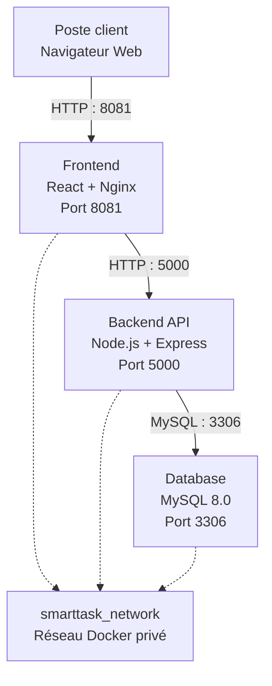

# SmartTask DevOps

SmartTask est une application web de gestion de tâches développée selon une architecture microservices et entièrement conteneurisée avec Docker.

Le projet met en œuvre une chaîne DevOps complète intégrant la conteneurisation, l'orchestration, le versionnement Git/GitHub et l'automatisation CI/CD avec Jenkins.

---

## 1. Architecture générale

SmartTask repose sur une architecture microservices composée de trois services principaux :

- **Frontend** : application React/Vite servie par Nginx
- **Backend** : API REST développée avec Node.js et Express
- **Database** : base de données MySQL 8.0



### Flux applicatif

```text
Poste client
     |
     | HTTP : 8081
     v
Frontend React / Nginx
     |
     | HTTP : 5000
     v
Backend Node.js / Express
     |
     | MySQL : 3306
     v
Base de données MySQL
```

---

## 2. Architecture réseau et communication inter-services

La communication entre les composants repose sur un réseau Docker privé nommé :

```text
smarttask_network
```

Les trois conteneurs sont connectés à ce réseau.

### 2.1 Communication Backend → Database

Le Backend communique avec MySQL à travers le réseau Docker interne.

Le serveur MySQL est accessible par son nom de service Docker :

```text
db
```

La variable d'environnement utilisée par le Backend est :

```env
DB_HOST=db
```

La communication Backend → MySQL utilise le port interne :

```text
3306
```

Aucune adresse IP statique de conteneur n'est nécessaire grâce à la résolution DNS intégrée à Docker Compose.

### 2.2 Communication Client → Frontend

Le navigateur du poste client accède au Frontend via le port `8081` de la machine hôte :

```text
http://<IP_SERVEUR>:8081
```

Le port `8081` de l'hôte est redirigé vers le port `80` du conteneur Nginx.

### 2.3 Communication Frontend → Backend

Le code JavaScript exécuté dans le navigateur consomme l'API Backend via le port `5000` exposé par le serveur :

```text
http://<IP_SERVEUR>:5000/api/tasks
```

Le Backend communique ensuite avec MySQL via le réseau Docker interne.

---

## 3. Technologies utilisées

| Composant | Technologie |
|---|---|
| Frontend | React / Vite |
| Serveur Web | Nginx |
| Backend | Node.js / Express |
| Base de données | MySQL 8.0 |
| Conteneurisation | Docker |
| Orchestration | Docker Compose |
| Versionnement | Git |
| Hébergement du dépôt | GitHub |
| CI/CD | Jenkins |
| Runtime JavaScript | Node.js 20 LTS |
| Java | OpenJDK 21 |

---

## 4. Objectifs du projet

L'objectif global de **SmartTask DevOps** est de concevoir, conteneuriser, automatiser et déployer une application web microservices complète en appliquant les principes et bonnes pratiques DevOps.

### 4.1 Conteneurisation et orchestration

| Objectif | Description |
|---|---|
| Isolation | Isoler le Frontend, le Backend et la base de données dans des conteneurs indépendants |
| Standardisation | Garantir un environnement reproductible entre les différentes machines |
| Orchestration | Permettre le démarrage de toute la stack avec Docker Compose |
| Persistance | Conserver les données MySQL grâce à un volume Docker |

### 4.2 Gestion du versionnement

Le projet utilise Git et GitHub pour :

- centraliser le code source ;
- suivre les modifications ;
- gérer les différentes versions ;
- séparer les environnements de développement et de production.

### 4.3 Automatisation CI/CD

Jenkins est utilisé pour automatiser la chaîne d'intégration et de déploiement continu.

Le pipeline est organisé autour des étapes suivantes :

```text
Checkout
    ↓
Build
    ↓
Tests
    ↓
Construction des images
    ↓
Déploiement
```

---

## 5. Structure du projet

```text
.
├── backend/                   # Service API Node.js / Express
│   ├── Dockerfile             # Image Docker du Backend
│   ├── package.json           # Dépendances Node.js
│   └── server.js              # Code source et endpoints REST
│
├── database/                  # Service MySQL
│   └── Dockerfile             # Image MySQL
│
├── frontend/                  # Interface React / Vite
│   ├── Dockerfile             # Image Docker Frontend
│   ├── index.html             # Point d'entrée HTML
│   ├── nginx.conf             # Configuration Nginx
│   ├── package.json           # Dépendances Node.js
│   ├── src/
│   │   ├── api/               # Communication avec l'API Backend
│   │   ├── components/        # Composants React
│   │   ├── App.jsx            # Composant principal
│   │   ├── main.jsx           # Point d'entrée React
│   │   └── index.css          # Styles globaux
│   └── vite.config.js         # Configuration Vite
│
├── .env.example               # Modèle des variables d'environnement
├── .gitignore                 # Fichiers exclus de Git
├── docker-compose.yml         # Orchestration des services
├── build-images.sh            # Script de construction des images
├── Jenkinsfile                # Pipeline CI/CD Jenkins
├── setup.sh                   # Script d'installation de l'environnement
└── README.md                  # Documentation du projet
```

---

## 6. Prérequis

L'environnement recommandé est un serveur Linux Ubuntu disposant d'un accès Internet et d'un compte utilisateur avec des privilèges `sudo`.

### Prérequis système

- Linux / Ubuntu recommandé
- Architecture x86_64 / amd64
- Accès Internet
- Compte utilisateur avec privilèges `sudo`
- Git 2.x ou supérieur

### Composants installés par `setup.sh`

Le script `setup.sh` automatise l'installation et la configuration de :

- Docker Engine
- Docker Compose
- Git
- Node.js 20 LTS
- npm
- OpenJDK 21
- Jenkins

Le script configure également :

- l'utilisateur courant dans le groupe `docker` ;
- l'utilisateur `jenkins` dans le groupe `docker` ;
- le démarrage automatique de Jenkins.

> Jenkins est nécessaire pour la partie CI/CD. Il n'est pas indispensable pour effectuer un déploiement manuel avec Docker Compose.

---

## 7. Installation et préparation de l'environnement

Le script `setup.sh`, présent à la racine du dépôt, permet de préparer automatiquement l'environnement nécessaire au projet.

### 7.1 Cloner le dépôt

Depuis le serveur de déploiement :

```bash
git clone https://github.com/kaman2803/smarttask-devops.git
cd smarttask-devops
```

La branche `Dev` étant la branche par défaut du dépôt, Git la sélectionne automatiquement lors du clonage.

### 7.2 Vérifier le script

Le script est versionné avec ses permissions d'exécution :

```bash
ls -l setup.sh
```

Il doit notamment apparaître avec le droit `x` :

```text
-rwxrwxr-x
```

Il n'est donc pas nécessaire d'exécuter `chmod +x setup.sh` après le clonage.

### 7.3 Exécuter l'installation

```bash
./setup.sh
```

Le script installe et configure automatiquement :

```text
Git
Docker Engine
Docker Compose
Node.js 20 LTS
npm
OpenJDK 21
Jenkins
```

Il configure également :

```text
Utilisateur courant → groupe docker
Jenkins → groupe docker
Jenkins → démarrage automatique
```

### 7.4 Appliquer les droits du groupe Docker

Lorsque l'installation est réalisée depuis une session SSH déjà ouverte, l'ajout au groupe `docker` n'est pas immédiatement disponible dans la session courante.

Exécuter :

```bash
newgrp docker
```

Ou fermer la session SSH puis se reconnecter.

Vérifier ensuite :

```bash
groups
```

Puis tester Docker sans `sudo` :

```bash
docker ps
```

> `newgrp docker` est uniquement nécessaire lorsque la session courante n'a pas encore pris en compte l'ajout de l'utilisateur au groupe `docker`.

### 7.5 Vérifier l'installation

Vérifier les versions installées :

```bash
docker --version
docker compose version
git --version
node -v
npm -v
java -version
```

Vérifier Jenkins :

```bash
sudo systemctl status jenkins --no-pager
```

Vérifier l'appartenance de Jenkins au groupe Docker :

```bash
groups jenkins
```

Le résultat doit notamment contenir :

```text
jenkins docker
```

---

## 8. Guide de déploiement

La branche `Dev` est la branche par défaut du dépôt et est utilisée pour le développement et les tests.

La branche `Prod` contient la version stable destinée à la production.

### 8.1 Préparer les variables d'environnement

Le fichier `.env` n'est pas versionné dans Git afin d'éviter de publier les informations sensibles.

Créer le fichier à partir du modèle :

```bash
cp .env.example .env
```

Modifier ensuite les valeurs :

```bash
nano .env
```

Exemple :

```env
MYSQL_ROOT_PASSWORD=<mot_de_passe_root>
MYSQL_DATABASE=smarttask_db
MYSQL_USER=smarttask_user
MYSQL_PASSWORD=<mot_de_passe_user>

DB_HOST=db
PORT=5000

PORT_FRONTEND=8081
PORT_BACKEND=5000
PORT_DB=3306
```

> Le fichier `.env` est exclu du dépôt grâce au fichier `.gitignore`. Il ne doit jamais être versionné.

### 8.2 Vérifier la configuration Docker Compose

Avant de démarrer les services :

```bash
docker compose config
```

Cette commande permet de vérifier notamment :

- les variables d'environnement ;
- les services ;
- les ports ;
- le réseau Docker ;
- le volume MySQL ;
- les dépendances entre les services.

### 8.3 Construire et démarrer la stack

```bash
docker compose up -d --build
```

Cette commande :

1. construit les trois images Docker ;
2. crée le réseau `smarttask_network` ;
3. crée le volume `smarttask_db_data` ;
4. démarre MySQL ;
5. attend que MySQL soit disponible ;
6. démarre le Backend ;
7. démarre le Frontend.

### 8.4 Vérifier l'état des conteneurs

```bash
docker compose ps
```

Résultat attendu :

| Conteneur | Service | État attendu | Port |
|---|---|---|---|
| `smarttask_frontend` | Frontend | Up / Healthy | `8081 → 80` |
| `smarttask_backend` | Backend | Up | `5000 → 5000` |
| `smarttask_db` | MySQL | Up / Healthy | `3306 → 3306` |

Vérifier également les conteneurs actifs :

```bash
docker ps
```

### 8.5 Consulter les logs

Afficher les logs de l'ensemble de la stack :

```bash
docker compose logs
```

Suivre les logs en temps réel :

```bash
docker compose logs -f
```

Consulter les logs d'un service particulier :

```bash
docker compose logs backend
docker compose logs db
docker compose logs frontend
```

---

## 9. Vérification du déploiement

### 9.1 Vérification du Backend

Tester la route principale :

```bash
curl http://localhost:5000/
```

Réponse attendue :

```json
{
  "message": "API SmartTask opérationnelle et connectée à la base de données !"
}
```

Les logs Backend doivent également indiquer :

```text
Backend SmartTask démarré sur le port 5000
Table "tasks" vérifiée / créée avec succès dans MySQL.
```

### 9.2 Test du Healthcheck

```bash
curl http://localhost:5000/api/health
```

Réponse attendue :

```json
{
  "status": "OK",
  "timestamp": "..."
}
```

### 9.3 Test GET

Tester la récupération des tâches :

```bash
curl http://localhost:5000/api/tasks
```

Lorsque la base est vide :

```json
[]
```

### 9.4 Test Frontend

Vérifier que Nginx sert correctement l'application React :

```bash
curl -I http://localhost:8081
```

Une réponse HTTP `200 OK` confirme que le Frontend est accessible.

Exemple :

```text
HTTP/1.1 200 OK
Server: nginx/1.31.3
Content-Type: text/html
```

Depuis un poste client du réseau :

```text
http://<IP_SERVEUR>:8081
```

Exemple :

```text
http://192.168.120.3:8081
```

---

## 10. Test CRUD de l'API REST

Le fonctionnement de l'API est vérifié à travers les quatre opérations CRUD :

```text
Create
Read
Update
Delete
```

### 10.1 CREATE - Création d'une tâche

```bash
curl -X POST http://localhost:5000/api/tasks \
  -H "Content-Type: application/json" \
  -d '{
    "title": "Test Docker",
    "description": "Test de déploiement SmartTask",
    "status": "À faire",
    "priority": "high"
  }'
```

Réponse attendue :

```json
{
  "id": 1,
  "title": "Test Docker",
  "description": "Test de déploiement SmartTask",
  "status": "À faire",
  "priority": "high"
}
```

### 10.2 READ - Lecture des tâches

```bash
curl http://localhost:5000/api/tasks
```

La tâche créée doit apparaître dans la réponse.

### 10.3 UPDATE - Modification d'une tâche

```bash
curl -X PUT http://localhost:5000/api/tasks/1 \
  -H "Content-Type: application/json" \
  -d '{
    "title": "Test Docker modifié",
    "description": "Test CRUD SmartTask",
    "status": "En cours",
    "priority": "medium"
  }'
```

Vérifier la modification :

```bash
curl http://localhost:5000/api/tasks
```

### 10.4 DELETE - Suppression d'une tâche

```bash
curl -X DELETE http://localhost:5000/api/tasks/1
```

Réponse attendue :

```json
{
  "message": "Tâche supprimée avec succès"
}
```

Vérification finale :

```bash
curl http://localhost:5000/api/tasks
```

Résultat attendu :

```json
[]
```

---

## 11. Résultat de la validation

Les tests réalisés sur l'environnement de déploiement ont confirmé le bon fonctionnement de la stack.

| Élément vérifié | Résultat |
|---|---|
| Image MySQL | ✅ Construite |
| Conteneur MySQL | ✅ Healthy |
| Image Backend | ✅ Construite |
| Conteneur Backend | ✅ Opérationnel |
| Image Frontend | ✅ Construite |
| Conteneur Frontend | ✅ Healthy |
| Réseau Docker | ✅ Créé |
| Volume MySQL | ✅ Créé |
| Backend → MySQL | ✅ Validé |
| API principale | ✅ Validée |
| API Healthcheck | ✅ Validée |
| API GET | ✅ Validée |
| API POST | ✅ Validée |
| API PUT | ✅ Validée |
| API DELETE | ✅ Validée |
| Frontend / Nginx | ✅ HTTP 200 |
| CRUD complet | ✅ Validé |

---

## 12. Ports et endpoints

### 12.1 Ports exposés

| Composant | Service Docker | Port hôte | Port conteneur | Accès |
|---|---|---:|---:|---|
| Frontend | `smarttask_frontend` | `8081` | `80` | `http://<IP_SERVEUR>:8081` |
| Backend API | `smarttask_backend` | `5000` | `5000` | `http://<IP_SERVEUR>:5000` |
| MySQL | `smarttask_db` | `3306` | `3306` | `<IP_SERVEUR>:3306` |

### 12.2 Endpoints REST

| Méthode | Endpoint | Description |
|---|---|---|
| `GET` | `/` | Vérification de l'API |
| `GET` | `/api/health` | Healthcheck de l'API |
| `GET` | `/api/tasks` | Récupération des tâches |
| `POST` | `/api/tasks` | Création d'une tâche |
| `PUT` | `/api/tasks/:id` | Modification d'une tâche |
| `DELETE` | `/api/tasks/:id` | Suppression d'une tâche |

---

## 13. Gestion de la stack Docker

### Arrêter les conteneurs

Pour arrêter la stack sans supprimer les données :

```bash
docker compose down
```

Le volume MySQL est conservé.

### Redémarrer la stack

```bash
docker compose up -d
```

### Supprimer complètement la stack

```bash
docker compose down -v
```

> ⚠️ L'option `-v` supprime le volume MySQL et entraîne donc la suppression des données persistantes de la base de données.

---

## 14. Stratégie Git

Le projet utilise deux branches principales.

### Branche `Dev`

La branche `Dev` est la branche par défaut du dépôt.

Elle est utilisée pour :

- le développement ;
- l'intégration des nouvelles fonctionnalités ;
- les corrections ;
- les tests ;
- l'intégration continue.

### Branche `Prod`

La branche `Prod` contient la version stable destinée à la production.

Pour travailler explicitement sur la branche `Prod` :

```bash
git switch Prod
```

Pour vérifier la branche courante :

```bash
git branch --show-current
```

Pour consulter l'état du dépôt :

```bash
git status
```

---

## 15. CI/CD avec Jenkins

Le projet met en œuvre une chaîne CI/CD automatisée avec Jenkins afin de construire, versionner et publier les images Docker de l'application SmartTask.

L'architecture CI/CD repose sur :

- **Jenkins**
- **Jenkins Multibranch Pipeline**
- **GitHub** comme gestionnaire du code source
- **Un agent Docker personnalisé**
- **Docker Engine**
- **Docker Hub** comme registre d'images
- Deux branches principales : `Dev` et `Prod`

### 15.1 Architecture du pipeline

```text
                         GitHub
                            │
                            │ Push / Commit
                            ▼
                  Jenkins Multibranch
                            │
                  Détection des branches
                            │
                   ┌────────┴────────┐
                   │                 │
                  Dev               Prod
                   │                 │
                   └────────┬────────┘
                            ▼
                  Agent Docker Jenkins
                            │
                            ▼
                    Checkout du code
                            │
                            ▼
                  Build des images Docker
                            │
                            ▼
                     Tag des images
                            │
                            ▼
                    Docker Hub Login
                            │
                            ▼
                  Push vers Docker Hub
                            │
                    ┌───────┼───────┐
                    ▼       ▼       ▼
                Frontend  Backend  Database
```

### 15.2 Jenkins Multibranch Pipeline

Le projet utilise un **Jenkins Multibranch Pipeline** connecté au dépôt GitHub :

```text
https://github.com/kaman2803/smarttask-devops
```

Le pipeline détecte automatiquement les branches du dépôt.

Les branches utilisées sont :

```text
Dev
Prod
```

Chaque branche possède son propre contexte d'exécution Jenkins.

Le fichier :

```text
Jenkinsfile
```

est récupéré directement depuis la branche concernée.

### 15.3 Agent Docker personnalisé

Pour permettre à Jenkins d'exécuter les commandes Docker, un agent Docker personnalisé a été créé.

Le fichier utilisé est :

```text
jenkins-agent/Dockerfile
```

Contenu :

```dockerfile
FROM jenkins/inbound-agent:latest

USER root

RUN apt-get update \
    && apt-get install -y docker.io \
    && apt-get clean \
    && rm -rf /var/lib/apt/lists/*

USER jenkins
```

Cet agent ajoute la CLI Docker à l'image officielle Jenkins.

L'image a été construite localement avec :

```bash
docker build -t smarttask-jenkins-agent:latest ./jenkins-agent
```

Vérification :

```bash
docker images | grep smarttask-jenkins-agent
```

Résultat obtenu :

```text
smarttask-jenkins-agent:latest
```

La présence de la CLI Docker dans l'agent a été validée avec :

```bash
docker run --rm \
  --entrypoint docker \
  smarttask-jenkins-agent:latest \
  --version
```

Résultat :

```text
Docker version 26.1.5+dfsg1, build a72d7cd
```

L'agent Jenkins utilise également le socket Docker de l'hôte :

```text
/var/run/docker.sock
```

Ce montage permet aux commandes Docker exécutées depuis le conteneur Jenkins de communiquer avec le démon Docker de la machine hôte.

### 15.4 Authentification GitHub

Jenkins est connecté à GitHub avec des informations d'authentification permettant d'accéder au dépôt du projet.

Lors de l'exécution du pipeline, Jenkins récupère automatiquement le fichier :

```text
Jenkinsfile
```

depuis le commit correspondant.

Exemple observé dans les journaux Jenkins :

```text
Connecting to https://api.github.com
Obtained Jenkinsfile from ...
```

### 15.5 Authentification Docker Hub

Les identifiants Docker Hub sont enregistrés dans les **Jenkins Credentials**.

Le pipeline utilise ces credentials pour se connecter au registre Docker Hub sans exposer le mot de passe dans les journaux.

La connexion est réalisée avec :

```bash
docker login --username kaman2803 --password-stdin
```

Le pipeline utilise `withCredentials` afin de masquer le mot de passe.

Le résultat attendu est :

```text
Login Succeeded
```

À la fin du pipeline, Jenkins ferme également la session Docker Hub :

```bash
docker logout
```

### 15.6 Construction et publication des images

Le pipeline construit les trois images principales :

```text
smarttask-frontend
smarttask-backend
smarttask-database
```

Les images sont ensuite associées à des tags correspondant à la branche et au numéro de build Jenkins.

Pour la branche `Dev`, un exemple de tag généré est :

```text
Dev-2
```

Les images sont ensuite publiées sur Docker Hub :

```text
kaman2803/smarttask-frontend
kaman2803/smarttask-backend
kaman2803/smarttask-database
```

Pour la branche `Dev`, le pipeline publie notamment :

```text
Dev-2
latest
```

Pour la branche `Prod`, le numéro de build est utilisé de la même manière, par exemple :

```text
Prod-1
latest
```

### 15.7 Étapes du pipeline

Le pipeline Jenkins réalise les opérations suivantes :

```text
1. Checkout
      ↓
2. Construction des images Docker
      ↓
3. Attribution des tags
      ↓
4. Connexion à Docker Hub
      ↓
5. Publication des images
      ↓
6. Docker logout
```

Les journaux Jenkins permettent de suivre chaque étape.

Exemple :

```text
[Pipeline] stage
[Pipeline] { (Push Docker Hub)
=== 5. Publication des images ===
```

Les trois images sont publiées successivement :

```text
kaman2803/smarttask-database
kaman2803/smarttask-backend
kaman2803/smarttask-frontend
```

### 15.8 Validation de la CI/CD

Le pipeline de la branche `Dev` a été exécuté avec succès.

Résultat Jenkins :

```text
Pipeline exécuté avec succès pour la branche Dev.
Finished: SUCCESS
```

Les trois images ont été publiées sur Docker Hub avec succès.

La branche `Prod` a également été exécutée avec succès :

```text
Pipeline exécuté avec succès pour la branche Prod.
Finished: SUCCESS
```

Les journaux Jenkins ont confirmé :

```text
Login Succeeded
```

ainsi que la publication des images avec leurs différents tags et leurs digest SHA256.

### 15.9 Résultat final

Les dépôts Docker Hub utilisés par le projet sont :

```text
kaman2803/smarttask-frontend
kaman2803/smarttask-backend
kaman2803/smarttask-database
```

La chaîne CI/CD permet donc de passer automatiquement du code source GitHub à des images Docker publiées dans Docker Hub.

---

## 16. Stratégie Git et workflow Dev/Prod

Le projet utilise deux branches principales :

```text
Dev
Prod
```

### 16.1 Branche Dev

La branche `Dev` est utilisée pour :

- le développement ;
- l'intégration des nouvelles fonctionnalités ;
- les corrections ;
- les tests ;
- la validation de la chaîne CI/CD.

Exemple :

```bash
git switch Dev
```

Vérification :

```bash
git status
```

### 16.2 Branche Prod

La branche `Prod` représente la version stable destinée à la production.

Exemple :

```bash
git switch Prod
```

Vérification :

```bash
git status
```

### 16.3 Workflow de promotion

Le workflow prévu est :

```text
Développement
      │
      ▼
     Dev
      │
      │ Validation
      ▼
    Merge
      │
      ▼
    Prod
      │
      │ Jenkins Multibranch
      ▼
  Build Docker
      │
      ▼
    Tag Prod-X
      │
      ▼
Publication Docker Hub
```

La branche `Prod` bénéficie donc du même mécanisme automatisé de construction et de publication que `Dev`.

---

## 17. CI/CD — Résumé de la chaîne automatisée

| Élément | Mise en œuvre |
|---|---|
| Gestion du code | Git |
| Hébergement | GitHub |
| Branches | `Dev` / `Prod` |
| CI/CD | Jenkins |
| Type de pipeline | Multibranch Pipeline |
| Agent | Agent Docker personnalisé |
| Docker CLI | Installée dans l'agent |
| Docker Engine | Socket `/var/run/docker.sock` |
| Build | Images Frontend / Backend / Database |
| Registry | Docker Hub |
| Authentification GitHub | Jenkins Credentials |
| Authentification Docker Hub | Jenkins Credentials |
| Tags | Branche + numéro de build |
| Publication | Automatique |
| Gestion des erreurs | Échec du pipeline en cas d'erreur |
| Journaux | Console Jenkins |

---

## 18. Structure finale du projet

La structure du dépôt comprend notamment :

```text
.
├── backend/
├── database/
├── frontend/
├── jenkins-agent/
│   └── Dockerfile
├── .env.example
├── .gitignore
├── docker-compose.yml
├── build-images.sh
├── Jenkinsfile
├── setup.sh
└── README.md
```

Le répertoire `jenkins-agent/` contient l'image personnalisée utilisée par Jenkins pour disposer de la CLI Docker.

---

## 19. Résumé global du projet

| Axe | Objectif | Résultat |
|---|---|:---:|
| Microservices | Frontend / Backend / Database | ✅ |
| Conteneurisation | Docker | ✅ |
| Orchestration | Docker Compose | ✅ |
| Réseau | `smarttask_network` | ✅ |
| Persistance | Volume MySQL | ✅ |
| Versionnement | Git | ✅ |
| Dépôt distant | GitHub | ✅ |
| Branches | `Dev` / `Prod` | ✅ |
| CI/CD | Jenkins | ✅ |
| Pipeline | Multibranch | ✅ |
| Agent Docker | Personnalisé | ✅ |
| Docker CLI | Installée dans l'agent | ✅ |
| Docker Hub | Authentification | ✅ |
| Build images | Automatisé | ✅ |
| Tags | Automatisés | ✅ |
| Push images | Automatisé | ✅ |
| Frontend | Publié | ✅ |
| Backend | Publié | ✅ |
| Database | Publié | ✅ |
| Branche Dev | Pipeline validé | ✅ |
| Branche Prod | Pipeline validé | ✅ |

---

## Conclusion

Le projet **SmartTask DevOps** met en œuvre une chaîne DevOps complète allant du développement du code jusqu'à la publication automatisée des images Docker.

L'application est organisée selon une architecture microservices composée d'un **Frontend React/Nginx**, d'un **Backend Node.js/Express** et d'une **base de données MySQL**. L'ensemble est conteneurisé et orchestré avec Docker Compose.

La gestion du code est assurée par Git et GitHub avec une séparation entre les branches `Dev` et `Prod`.

La partie CI/CD est automatisée avec **Jenkins Multibranch Pipeline**. Un **agent Docker personnalisé** a été créé afin de fournir la CLI Docker à Jenkins et de permettre la construction et la publication des images.

Le pipeline assure automatiquement :

```text
GitHub
   ↓
Jenkins Multibranch
   ↓
Checkout
   ↓
Build Docker
   ↓
Tag des images
   ↓
Docker Hub Login
   ↓
Push des images
   ↓
Docker Hub
```

Les pipelines des branches `Dev` et `Prod` ont été validés avec un résultat :

```text
Finished: SUCCESS
```

Les trois images suivantes sont désormais publiées sur Docker Hub :

```text
kaman2803/smarttask-frontend
kaman2803/smarttask-backend
kaman2803/smarttask-database
```

Le projet répond ainsi aux objectifs du **Projet 4 — Mise en place de la CI/CD avec Jenkins**, notamment :

- la mise en place de Jenkins ;
- la création d'un agent Docker personnalisé ;
- la configuration de l'authentification GitHub ;
- la configuration de l'authentification Docker Hub ;
- la mise en place d'un pipeline Multibranch ;
- la gestion des branches `Dev` et `Prod` ;
- l'automatisation de la construction des images Docker ;
- l'automatisation du tagging ;
- la publication automatique des images sur Docker Hub.

La chaîne complète permet ainsi d'automatiser le cycle :

```text
Code source
    ↓
GitHub
    ↓
Jenkins
    ↓
Build Docker
    ↓
Tag
    ↓
Docker Hub
    ↓
Images disponibles pour le déploiement
```
